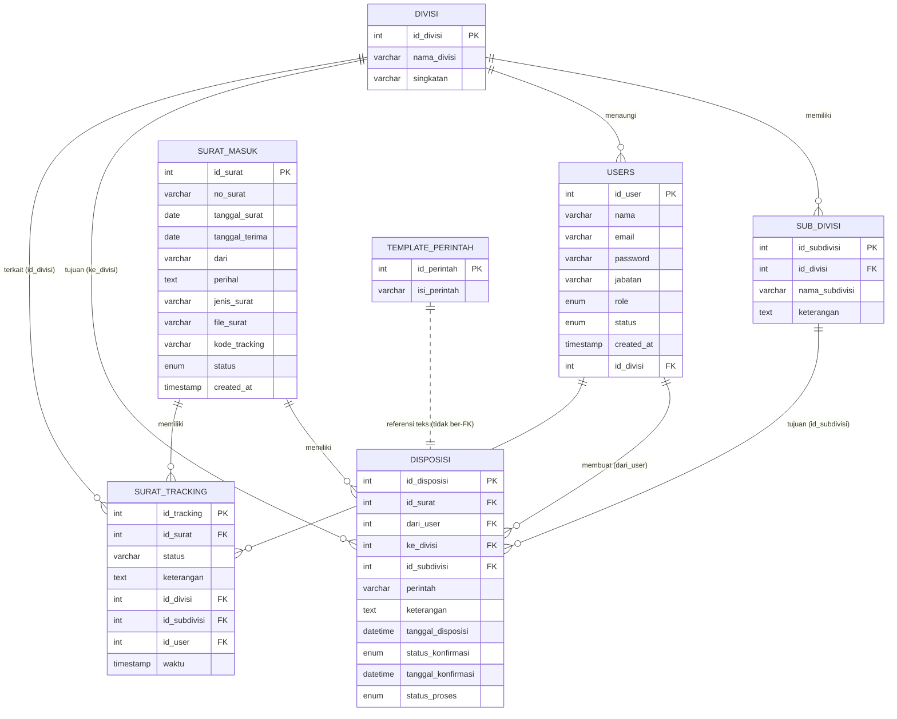

# Database Schema Documentation
## Sistem Informasi Pemantauan Surat Masuk — BNNP D.I. Yogyakarta

| | |
|---|---|
| **Nama Database** | `bnn_surat_2` |
| **DBMS** | MySQL / MariaDB (10.4.10-MariaDB) |
| **Engine** | InnoDB |
| **Charset** | utf8mb4 |

---

## 1. Daftar Tabel

| Tabel | Fungsi |
|---|---|
| `users` | Menyimpan akun pengguna sistem beserta role dan divisinya |
| `divisi` | Master data divisi/bidang |
| `sub_divisi` | Master data sub divisi/seksi di bawah suatu divisi |
| `surat_masuk` | Data utama surat masuk beserta file dan status terkini |
| `disposisi` | Catatan aksi disposisi surat (dari siapa, ke divisi/sub divisi mana, perintah apa) |
| `surat_tracking` | Log/riwayat kronologis setiap perubahan status surat (audit trail) |
| `template_perintah` | Master data template kalimat perintah disposisi |

---

## 2. Entity Relationship Diagram (ERD)

> **Catatan:** `template_perintah` tidak memiliki foreign key formal ke `disposisi` — teksnya hanya dipakai sebagai referensi/pilihan saat mengisi kolom `perintah` pada `disposisi`.

---

## 3. Detail Tabel

### 3.1 `users`
Menyimpan akun seluruh pengguna sistem.

| Kolom | Tipe | Null | Default | Keterangan |
|---|---|---|---|---|
| `id_user` | int(11) | ❌ | AUTO_INCREMENT | Primary Key |
| `nama` | varchar(100) | ❌ | — | Nama lengkap pengguna |
| `email` | varchar(100) | ❌ | — | Email, **unique** |
| `password` | varchar(255) | ❌ | — | Password ter-hash (bcrypt) |
| `jabatan` | varchar(100) | ✅ | NULL | Jabatan pengguna |
| `role` | enum | ❌ | — | `superadmin`, `admin`, `kepala`, `divisi`, `umum` |
| `status` | enum | ✅ | `aktif` | `aktif`, `nonaktif` |
| `created_at` | timestamp | ❌ | current_timestamp() | Waktu akun dibuat |
| `id_divisi` | int(11) | ✅ | NULL | FK → `divisi.id_divisi` |

**Constraint:**
- `UNIQUE (email)`
- `FOREIGN KEY (id_divisi) REFERENCES divisi(id_divisi) ON DELETE SET NULL ON UPDATE CASCADE`

**Catatan:** enum `role` di database (`superadmin`, `admin`, `kepala`, `divisi`, `umum`) memiliki 2 role tambahan (`superadmin`, `admin`) dibanding role yang dijelaskan pada PRD (`resepsionis`, `umum`, `kepala`, `divisi`) — perlu klarifikasi apakah `resepsionis` dipetakan ke salah satu role ini (kemungkinan `admin`), dan bagaimana posisi `superadmin`.

---

### 3.2 `divisi`
Master data divisi/bidang di BNNP DIY.

| Kolom | Tipe | Null | Default | Keterangan |
|---|---|---|---|---|
| `id_divisi` | int(11) | ❌ | AUTO_INCREMENT | Primary Key |
| `nama_divisi` | varchar(100) | ❌ | — | Nama divisi |
| `singkatan` | varchar(50) | ✅ | NULL | Singkatan nama divisi |

**Data saat ini (8 divisi):** Umum, Pemberantasan, P2M, Rehabilitasi, BNN Kota Yogyakarta, BNN Kabupaten Sleman, BNN Kabupaten Bantul, Spri Kepala.

---

### 3.3 `sub_divisi`
Master data seksi/sub-unit di bawah suatu divisi.

| Kolom | Tipe | Null | Default | Keterangan |
|---|---|---|---|---|
| `id_subdivisi` | int(11) | ❌ | AUTO_INCREMENT | Primary Key |
| `id_divisi` | int(11) | ❌ | — | FK → `divisi.id_divisi` |
| `nama_subdivisi` | varchar(100) | ❌ | — | Nama sub divisi |
| `keterangan` | text | ✅ | NULL | Catatan tambahan |

**Constraint:**
- `FOREIGN KEY (id_divisi) REFERENCES divisi(id_divisi) ON DELETE CASCADE`

**Contoh data:** Divisi "Umum" (id 1) memiliki sub divisi Keuangan, TU dan Kepegawaian, Perencanaan, Kehumasan, Kerja Sama, Sekretaris ZI, PPID, PPK, Sarpras. Divisi "Pemberantasan" memiliki Seksi Intelijen, Tim Penyidikan, Seksi Pengawasan Tahanan dan Barang Bukti, dst.

---

### 3.4 `surat_masuk`
Tabel utama data surat masuk.

| Kolom | Tipe | Null | Default | Keterangan |
|---|---|---|---|---|
| `id_surat` | int(11) | ❌ | AUTO_INCREMENT | Primary Key |
| `no_surat` | varchar(100) | ❌ | — | Nomor surat |
| `tanggal_surat` | date | ✅ | NULL | Tanggal surat dibuat pengirim |
| `tanggal_terima` | date | ✅ | NULL | Tanggal surat diterima BNNP DIY |
| `dari` | varchar(150) | ✅ | NULL | Instansi/pihak pengirim |
| `perihal` | text | ✅ | NULL | Perihal surat |
| `jenis_surat` | varchar(100) | ✅ | NULL | Jenis surat |
| `file_surat` | varchar(255) | ✅ | NULL | Path file (mis. `/uploads/xxx.pdf`) |
| `kode_tracking` | varchar(100) | ✅ | NULL | Kode unik pelacakan, format `TRK-<timestamp>` |
| `status` | enum | ✅ | `Menunggu` | `Menunggu`, `Diterima`, `Disposisi Kepala`, `Disposisi Divisi`, `Disposisi Divisi Umum` |
| `created_at` | timestamp | ❌ | current_timestamp() | Waktu record dibuat |

**Catatan:**
- Tidak ada FK keluar dari tabel ini — tabel ini menjadi tabel **induk** yang direferensikan `disposisi` dan `surat_tracking`.
- Nilai enum `status` saat ini **tidak mencakup** status seperti "Disposisi Sub Divisi" atau "Disposisi Divisi Diterima" yang justru muncul di data tabel `surat_tracking` (lihat §4 — Temuan & Rekomendasi).

---

### 3.5 `disposisi`
Mencatat setiap tindakan disposisi resmi terhadap sebuah surat (siapa mendisposisikan ke mana, dengan perintah apa, dan status konfirmasinya).

| Kolom | Tipe | Null | Default | Keterangan |
|---|---|---|---|---|
| `id_disposisi` | int(11) | ❌ | AUTO_INCREMENT | Primary Key |
| `id_surat` | int(11) | ❌ | — | FK → `surat_masuk.id_surat` |
| `dari_user` | int(11) | ❌ | — | FK → `users.id_user` (pembuat disposisi) |
| `ke_divisi` | int(11) | ❌ | — | FK → `divisi.id_divisi` (tujuan) |
| `id_subdivisi` | int(11) | ✅ | NULL | FK → `sub_divisi.id_subdivisi` (tujuan lanjutan, opsional) |
| `perintah` | varchar(255) | ✅ | NULL | Jenis perintah (bisa diisi dari `template_perintah`) |
| `keterangan` | text | ✅ | NULL | Catatan tambahan disposisi |
| `tanggal_disposisi` | datetime | ✅ | current_timestamp() | Waktu disposisi dibuat |
| `status_konfirmasi` | enum | ✅ | `belum diterima` | `belum diterima`, `diterima` |
| `tanggal_konfirmasi` | datetime | ✅ | NULL | Waktu divisi/sub divisi mengonfirmasi penerimaan |
| `status_proses` | enum | ❌ | — | `menunggu_umum`, `dikirim`, `menunggu_divisi`, `selesai` |

**Constraint:**
- `FOREIGN KEY (id_surat) REFERENCES surat_masuk(id_surat) ON DELETE CASCADE`
- `FOREIGN KEY (dari_user) REFERENCES users(id_user) ON DELETE CASCADE`
- `FOREIGN KEY (ke_divisi) REFERENCES divisi(id_divisi) ON DELETE CASCADE`
- `FOREIGN KEY (id_subdivisi) REFERENCES sub_divisi(id_subdivisi) ON DELETE SET NULL ON UPDATE CASCADE`

---

### 3.6 `surat_tracking`
Log kronologis seluruh perubahan status surat — inilah sumber data untuk fitur **tracking/pelacakan** yang dijadikan tujuan utama sistem.

| Kolom | Tipe | Null | Default | Keterangan |
|---|---|---|---|---|
| `id_tracking` | int(11) | ❌ | AUTO_INCREMENT | Primary Key |
| `id_surat` | int(11) | ❌ | — | FK (secara logis) → `surat_masuk.id_surat` |
| `status` | varchar(150) | ❌ | — | Label status bebas (free text), mis. "Diterima", "Disposisi Kepala" |
| `keterangan` | text | ✅ | NULL | Catatan/deskripsi aksi |
| `id_divisi` | int(11) | ✅ | NULL | Divisi terkait aksi (bila relevan) |
| `id_subdivisi` | int(11) | ✅ | NULL | Sub divisi terkait aksi (bila relevan) |
| `id_user` | int(11) | ✅ | NULL | Pengguna yang melakukan aksi |
| `waktu` | timestamp | ❌ | current_timestamp() | Waktu aksi tercatat |

**Catatan penting:** tabel ini **tidak memiliki foreign key constraint** sama sekali di level database (tidak seperti `disposisi`) — relasi ke `surat_masuk`, `divisi`, `sub_divisi`, dan `users` bersifat implisit (hanya dijamin secara logika aplikasi, bukan oleh database). Lihat rekomendasi di §4.

---

### 3.7 `template_perintah`
Master data pilihan kalimat perintah disposisi (dropdown), agar Kepala/Umum tidak perlu mengetik ulang.

| Kolom | Tipe | Null | Default | Keterangan |
|---|---|---|---|---|
| `id_perintah` | int(11) | ❌ | AUTO_INCREMENT | Primary Key |
| `isi_perintah` | varchar(255) | ❌ | — | Isi teks perintah |

**Contoh data (12 template):** "UPS / Simpan", "Untuk Diproses / Tindak Lanjuti", "Sebagai Pedoman", "Saran / Bicarakan dengan Saya", "Agendakan / Ingatkan Saya", "Hadiri / Wakili Saya", "Buat Nodin / Laporan / Sprin", "Koordinasikan / Hubungi Yang Bersangkutan", "Check / Ikuti Perkembangannya", "Info Untuk Semua Pegawai", "Penuhi", "Laporkan Hasilnya".

---

## 4. Temuan & Rekomendasi (berdasarkan struktur & data saat ini)

| # | Temuan | Rekomendasi |
|---|---|---|
| 1 | Enum `users.role` (`superadmin`, `admin`, `kepala`, `divisi`, `umum`) belum memiliki nilai untuk role **Resepsionis** yang disebut di PRD. | Klarifikasi: apakah Resepsionis memakai role `admin`, atau perlu ditambahkan nilai enum baru `resepsionis`. |
| 2 | Enum `surat_masuk.status` tidak memiliki nilai `"Disposisi Sub Divisi"` atau `"Disposisi Divisi Diterima"`, padahal nilai-nilai tersebut muncul sebagai `status` pada `surat_tracking` (contoh: id_tracking 109, 110). | Selaraskan daftar status resmi di `surat_masuk.status` dengan seluruh kemungkinan `status` yang ditulis ke `surat_tracking`, agar status utama surat selalu konsisten dengan riwayatnya. |
| 3 | Tabel `surat_tracking` tidak memiliki foreign key ke `surat_masuk`, `divisi`, `sub_divisi`, maupun `users`, berbeda dengan `disposisi` yang sudah memakai FK penuh. | Tambahkan FK (minimal ke `surat_masuk.id_surat` dengan `ON DELETE CASCADE`) agar integritas data riwayat tracking terjamin di level database, tidak hanya di level aplikasi. |
| 4 | `template_perintah` tidak terhubung secara relasional (FK) ke `disposisi.perintah` — kolom `perintah` di `disposisi` bertipe `varchar` bebas, bukan referensi `id_perintah`. | Bila ingin konsistensi/pelaporan lebih akurat, pertimbangkan menyimpan `id_perintah` (FK) di `disposisi`, atau tetap pertahankan `varchar` bila perintah bisa diedit bebas oleh Kepala. |
| 5 | `disposisi.status_proses` memiliki nilai `menunggu_umum` dan `dikirim` yang tidak terlihat dipakai pada data contoh maupun pada kode controller yang telah dibuat sejauh ini. | Pastikan alur aplikasi (backend) benar-benar memanfaatkan seluruh nilai enum ini, atau sederhanakan enum bila beberapa nilai sudah tidak relevan dengan alur bisnis final. |
| 6 | Tidak ada tabel/kolom untuk **riwayat perubahan password** atau **log login**, serta tidak ada kolom `updated_at` pada sebagian besar tabel. | Pertimbangkan menambah `updated_at` pada `surat_masuk`, `users`, `disposisi` untuk keperluan audit lanjutan bila dibutuhkan. |

---

## 5. Ringkasan Relasi Antar Tabel

| Tabel Asal | Kolom FK | Tabel Tujuan | Aksi saat Delete |
|---|---|---|---|
| `sub_divisi` | `id_divisi` | `divisi.id_divisi` | CASCADE |
| `users` | `id_divisi` | `divisi.id_divisi` | SET NULL |
| `disposisi` | `id_surat` | `surat_masuk.id_surat` | CASCADE |
| `disposisi` | `dari_user` | `users.id_user` | CASCADE |
| `disposisi` | `ke_divisi` | `divisi.id_divisi` | CASCADE |
| `disposisi` | `id_subdivisi` | `sub_divisi.id_subdivisi` | SET NULL |
| `surat_tracking` | `id_surat` *(implisit, tanpa FK)* | `surat_masuk.id_surat` | — |
| `surat_tracking` | `id_divisi` *(implisit, tanpa FK)* | `divisi.id_divisi` | — |
| `surat_tracking` | `id_subdivisi` *(implisit, tanpa FK)* | `sub_divisi.id_subdivisi` | — |
| `surat_tracking` | `id_user` *(implisit, tanpa FK)* | `users.id_user` | — |
